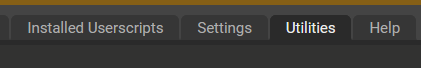
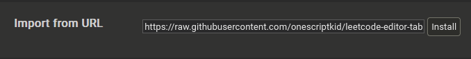

# 🪄 leetcode-editor-tab-2-spaces

Leetcode's text editor persists a **4 space tab** even when this config is **saved** & set to **2 spaces**; the bug remains unaddressed - [1](https://github.com/LeetCode-Feedback/LeetCode-Feedback/issues/9314), [2](https://leetcode.com/discuss/feedback/1204698/leetcode-editor-spaces), [3](https://leetcode.com/discuss/general-discussion/443045/leetcode-text-editor-minor-issue-that-bugs-me).


Running the [userscript](https://raw.githubusercontent.com/onescriptkid/leetcode-editor-tab-2-spaces/refs/heads/master/leetcode-editor-tab-2-spaces.js), `leetcode-editor-tab-2-spaces.js`, automatically forces a **2 space tab**.

The script is **brittle** and contingent on leetcode not changing their problemset dom substantially.

## 🐵 QuickStart

1. Download & install [TamperMonkey](https://addons.mozilla.org/en-US/firefox/addon/tampermonkey/)
2. *Click* **extensions** and *select* **TamperMonkey**,
3. *Click* **Create a new script...** and *select* the **Utilities** tab.
   
	

	

4. *Copy & paste* the raw url into **Import from URL** and *click* **Install**.
	```
	https://raw.githubusercontent.com/onescriptkid/leetcode-editor-tab-2-spaces/refs/heads/master/leetcode-editor-tab-2-spaces.j
	```
	

5. *Navigate* to your favorite [leetcode problem.](https://leetcode.com/problems/4sum/description/)

## ✂️ Alternatively, copy & paste the code snippet into the console

`leetcode-editor-tab-2-spaces.js`
```js
async function toggleLeetCodeEditor() {
	//...
}
toggleLeetCodeEditor()
```

Though, this solution is only marginally better than simply manually toggling the **tab 2 spaces** setting yourself.

