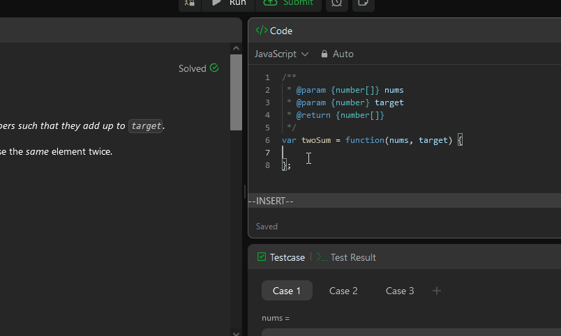

# 🪄 leetcode-editor-tab-2-spaces

The leetcode editor persists a **4 space tab** even when saved & set to **2 spaces** - and this bug collects dust on leetcode's backlog - [1](https://github.com/LeetCode-Feedback/LeetCode-Feedback/issues/9314), [2](https://leetcode.com/discuss/feedback/1204698/leetcode-editor-spaces), [3](https://leetcode.com/discuss/general-discussion/443045/leetcode-text-editor-minor-issue-that-bugs-me).



The attached code snippet, `leetcode-editor-tab-2-spaces.js`, automatically forces a **2 space tab**
The script's brittle, jank, and contingent on leetcode not changing their dom substantially.

## ✂️ Copy & Paste the snippet into the console to automatically

`leetcode-editor-tab-2-spaces.js`
```js
async function toggleLeetCodeEditor() {
	//...
}
toggleLeetCodeEditor()
```

## 🧩 WIP extension or automatic solution
Copy & pasting the script into the console is marginally better than clicking through the modal manually.
Creating an extension and automatically running on domload is ideal.

